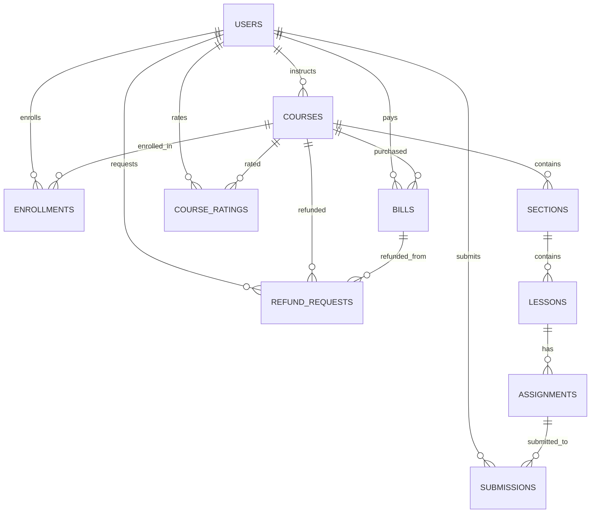

### CÁC THỰC THỂ CHÍNH CỦA DATABASE — LMS

#### Tổng quan
- CSDL sử dụng: MongoDB (document-based, linh hoạt mở rộng)
- Thực thể cốt lõi: Users, Courses, Sections, Lessons, Assignments, Submissions, Enrollments, Bills, RefundRequests, CourseRatings
- Quy ước: Tất cả thực thể có `createdAt`, `updatedAt` (ISO Date)

---

### 1) USERS — Người dùng
- Mô tả: Tất cả tài khoản trong hệ thống (student/teacher/admin)
- Quan hệ:
  - 1:N với `COURSES` (giảng viên)
  - 1:N với `ENROLLMENTS`, `BILLS`, `SUBMISSIONS`, `REFUND_REQUESTS`, `COURSE_RATINGS`

```typescript
interface User {
  _id: ObjectId;
  email: string;                 // unique
  password: string;              // hashed
  name: string;
  avatar?: string;
  roles: ('student' | 'teacher' | 'admin')[];
  subscriptionPlan: 'free' | 'pro' | 'advanced';
  subscriptionExpiresAt?: Date;
  isActive: boolean;
  emailVerified: boolean;
  createdAt: Date;
  updatedAt: Date;
}
```

---

### 2) COURSES — Khóa học
- Mô tả: Thông tin khóa học, trạng thái duyệt/publish
- Quan hệ:
  - N:1 với `USERS` (instructorId)
  - 1:N với `SECTIONS`, `ENROLLMENTS`, `BILLS`, `REFUND_REQUESTS`, `COURSE_RATINGS`

```typescript
interface Course {
  _id: ObjectId;
  title: string;
  description: string;
  thumbnail?: string;
  domain: string;                        // 'IT', 'Economics', 'Law', ...
  level: 'beginner' | 'intermediate' | 'advanced';
  prerequisites: string[];
  benefits: string[];
  relatedLinks: string[];
  instructorId: ObjectId;               // ref: Users
  price: number;
  isPublished: boolean;
  isApproved: boolean;
  upvotes: number;
  reports: number;
  enrolledStudents: ObjectId[];         // ref: Users
  createdAt: Date;
  updatedAt: Date;
}
```

---

### 3) SECTIONS — Phần học
- Mô tả: Phân chia nội dung theo chương/phần
- Quan hệ:
  - N:1 với `COURSES`
  - 1:N với `LESSONS`

```typescript
interface Section {
  _id: ObjectId;
  courseId: ObjectId;                   // ref: Courses
  title: string;
  order: number;                        // vị trí trong khóa học
  createdAt: Date;
  updatedAt: Date;
}
```

---

### 4) LESSONS — Bài học
- Mô tả: Bài học (video/text/file/link) thuộc một section
- Quan hệ:
  - N:1 với `SECTIONS`
  - 1:N với `ASSIGNMENTS`

```typescript
interface Lesson {
  _id: ObjectId;
  sectionId: ObjectId;                  // ref: Sections
  title: string;
  content: string;                      // rich text
  type: 'video' | 'text' | 'file' | 'link';
  videoUrl?: string;
  videoDuration?: number;               // seconds
  fileUrl?: string;
  order: number;
  isRequired: boolean;
  createdAt: Date;
  updatedAt: Date;
}
```

---

### 5) ASSIGNMENTS — Bài tập
- Mô tả: Bài tập nộp file/quiz cho một bài học
- Quan hệ:
  - N:1 với `LESSONS`
  - 1:N với `SUBMISSIONS`

```typescript
interface Assignment {
  _id: ObjectId;
  lessonId: ObjectId;                   // ref: Lessons
  title: string;
  description: string;
  type: 'file' | 'quiz';
  dueDate?: Date;
  maxScore: number;
  questions?: {
    question: string;
    options: string[];
    correctAnswer: string;
  }[];
  createdAt: Date;
  updatedAt: Date;
}
```

---

### 6) SUBMISSIONS — Bài nộp
- Mô tả: Bài nộp của học viên cho một bài tập
- Quan hệ:
  - N:1 với `ASSIGNMENTS`
  - N:1 với `USERS` (student)

```typescript
interface Submission {
  _id: ObjectId;
  assignmentId: ObjectId;               // ref: Assignments
  studentId: ObjectId;                  // ref: Users
  answers?: string[];                   // cho quiz
  fileUrl?: string;                     // cho file
  score?: number;
  submittedAt: Date;
  gradedAt?: Date;
}
```

---

### 7) ENROLLMENTS — Đăng ký khóa học
- Mô tả: Đăng ký, tiến độ học, chứng chỉ
- Quan hệ:
  - N:1 với `USERS` (student)
  - N:1 với `COURSES`

```typescript
interface Enrollment {
  _id: ObjectId;
  studentId: ObjectId;                  // ref: Users
  courseId: ObjectId;                   // ref: Courses
  enrolledAt: Date;
  completedAt?: Date;
  progress: number;                     // 0-100
  completedLessons: ObjectId[];         // ref: Lessons
  certificate?: string;                 // URL
  createdAt: Date;
  updatedAt: Date;
}
```

---

### 8) BILLS — Hóa đơn
- Mô tả: Giao dịch thanh toán (mua khóa học, subscription, refund)
- Quan hệ:
  - N:1 với `USERS` (student)
  - N:1 với `COURSES`

```typescript
interface Bill {
  _id: ObjectId;
  studentId: ObjectId;                  // ref: Users
  courseId: ObjectId;                   // ref: Courses
  amount: number;
  currency: string;                     // 'VND'
  paymentMethod: string;                // 'stripe', 'bank_transfer', ...
  status: 'pending' | 'completed' | 'failed' | 'refunded';
  transactionId: string;                // từ Stripe
  purpose: 'course_purchase' | 'subscription' | 'refund';
  paidAt?: Date;
  refundedAt?: Date;
  createdAt: Date;
  updatedAt: Date;
}
```

---

### 9) REFUND_REQUESTS — Yêu cầu hoàn tiền
- Mô tả: Yêu cầu hoàn tiền gắn với bill và khóa học
- Quan hệ:
  - N:1 với `USERS` (student)
  - N:1 với `COURSES`
  - N:1 với `BILLS`

```typescript
interface RefundRequest {
  _id: ObjectId;
  studentId: ObjectId;                  // ref: Users
  courseId: ObjectId;                   // ref: Courses
  billId: ObjectId;                     // ref: Bills
  reason: string;
  status: 'pending' | 'approved' | 'rejected';
  adminNotes?: string;
  requestedAt: Date;
  processedAt?: Date;
  createdAt: Date;
  updatedAt: Date;
}
```

---

### 10) COURSE_RATINGS — Đánh giá khóa học
- Mô tả: Upvote hoặc Report với giới hạn thời gian
- Quan hệ:
  - N:1 với `COURSES`
  - N:1 với `USERS` (student)

```typescript
interface CourseRating {
  _id: ObjectId;
  courseId: ObjectId;                   // ref: Courses
  studentId: ObjectId;                  // ref: Users
  type: 'upvote' | 'report';
  reason?: string;                      // cho report
  lastActionAt: Date;                   // enforce 7-day window
  createdAt: Date;
  updatedAt: Date;
}
```

---

### Sơ đồ quan hệ (ER)


---

### Gợi ý chỉ mục (Indexes) để tối ưu truy vấn
- `users.email` (unique), `users.roles`
- `courses.instructorId`, `courses.domain`, `courses.level`, `courses.isPublished`, `courses.isApproved`
- `sections.courseId`, `sections.order`
- `lessons.sectionId`, `lessons.order`, `lessons.type`
- `assignments.lessonId`, `submissions.assignmentId`, `submissions.studentId`
- `enrollments.studentId`, `enrollments.courseId`
- `bills.studentId`, `bills.courseId`, `bills.status`, `bills.purpose`, `bills.paidAt`
- `refundrequests.studentId`, `refundrequests.courseId`, `refundrequests.status`
- `courseratings.courseId`, `courseratings.studentId`, `courseratings.type`
