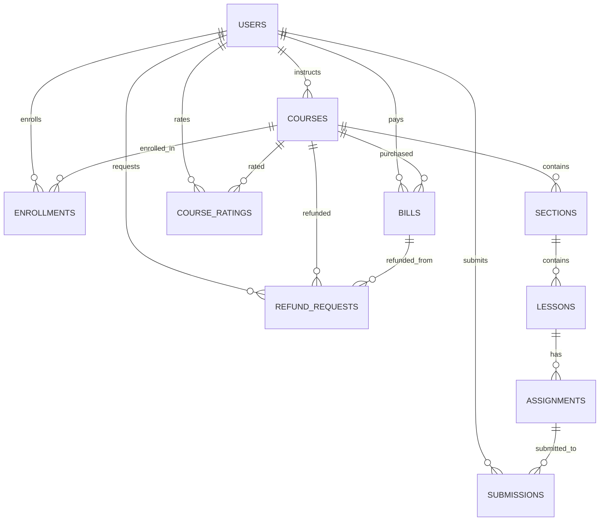

### ERD — Learning Management System (LMS)

#### Sơ đồ tổng quan (Mermaid)

#### Thuộc tính chính của các thực thể

- USERS
  - PK: `_id`
  - Unique: `email`
  - Fields: `name`, `password(hashed)`, `avatar`, `roles[]`, `subscriptionPlan`, `subscriptionExpiresAt`, `isActive`, `emailVerified`, `createdAt`, `updatedAt`

- COURSES
  - PK: `_id`
  - FK: `instructorId -> USERS._id`
  - Fields: `title`, `description`, `thumbnail`, `domain`, `level`, `price`, `isPublished`, `isApproved`, `upvotes`, `reports`, `createdAt`, `updatedAt`

- SECTIONS
  - PK: `_id`
  - FK: `courseId -> COURSES._id`
  - Fields: `title`, `order`, `createdAt`, `updatedAt`

- LESSONS
  - PK: `_id`
  - FK: `sectionId -> SECTIONS._id`
  - Fields: `title`, `content`, `type(video|text|file|link)`, `videoUrl`, `videoDuration`, `fileUrl`, `order`, `isRequired`, `createdAt`, `updatedAt`

- ASSIGNMENTS
  - PK: `_id`
  - FK: `lessonId -> LESSONS._id`
  - Fields: `title`, `description`, `type(file|quiz)`, `dueDate`, `maxScore`, `questions[]`, `createdAt`, `updatedAt`

- SUBMISSIONS
  - PK: `_id`
  - FK: `assignmentId -> ASSIGNMENTS._id`
  - FK: `studentId -> USERS._id`
  - Fields: `answers[]`, `fileUrl`, `score`, `submittedAt`, `gradedAt`

- ENROLLMENTS
  - PK: `_id`
  - FK: `studentId -> USERS._id`
  - FK: `courseId -> COURSES._id`
  - Fields: `enrolledAt`, `completedAt`, `progress`, `completedLessons[]`, `certificate`, `createdAt`, `updatedAt`

- BILLS
  - PK: `_id`
  - FK: `studentId -> USERS._id`
  - FK: `courseId -> COURSES._id`
  - Fields: `amount`, `currency`, `paymentMethod`, `status(pending|completed|failed|refunded)`, `transactionId`, `purpose(course_purchase|subscription|refund)`, `paidAt`, `refundedAt`, `createdAt`, `updatedAt`

- REFUND_REQUESTS
  - PK: `_id`
  - FK: `studentId -> USERS._id`
  - FK: `courseId -> COURSES._id`
  - FK: `billId -> BILLS._id`
  - Fields: `reason`, `status(pending|approved|rejected)`, `adminNotes`, `requestedAt`, `processedAt`, `createdAt`, `updatedAt`

- COURSE_RATINGS
  - PK: `_id`
  - FK: `courseId -> COURSES._id`
  - FK: `studentId -> USERS._id`
  - Fields: `type(upvote|report)`, `reason`, `lastActionAt`, `createdAt`, `updatedAt`

#### Ghi chú thiết kế
- Chuẩn hóa chỉ mục (indexes) gợi ý:
  - `users(email)` unique, `users(roles)`
  - `courses(instructorId, isPublished, isApproved)`, `courses(domain)`, `courses(level)`
  - `sections(courseId, order)`, `lessons(sectionId, order, type)`
  - `assignments(lessonId)`, `submissions(assignmentId, studentId)`
  - `enrollments(studentId, courseId)` unique composite
  - `bills(studentId, courseId, status, purpose, paidAt)`
  - `refund_requests(studentId, courseId, status)`, `course_ratings(courseId, studentId, type)`
- Ràng buộc nghiệp vụ tiêu biểu:
  - Mỗi `(studentId, courseId)` chỉ có 1 `ENROLLMENT`
  - `COURSE_RATINGS`: enforce 7 ngày giữa các hành động lặp lại theo `(studentId, courseId, type)`
  - `REFUND_REQUESTS` chỉ được `approved` nếu `BILLS.status = completed` và trong SLA (ví dụ 7 ngày)
