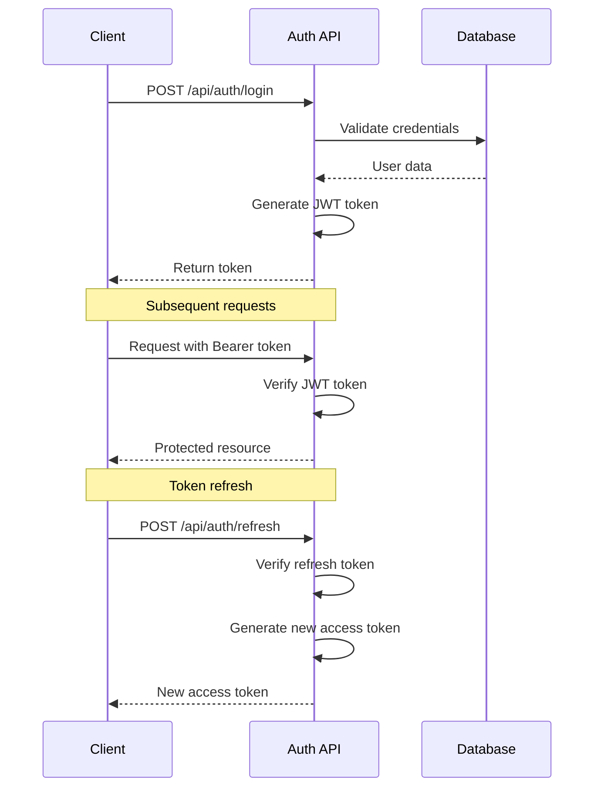
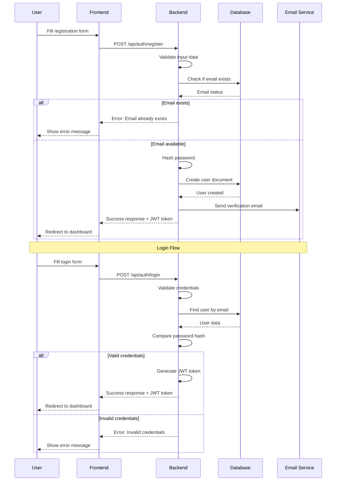
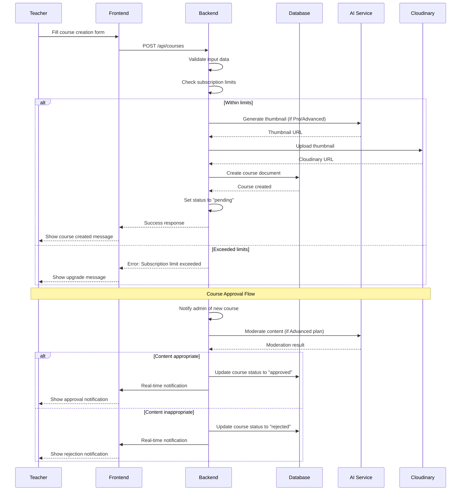
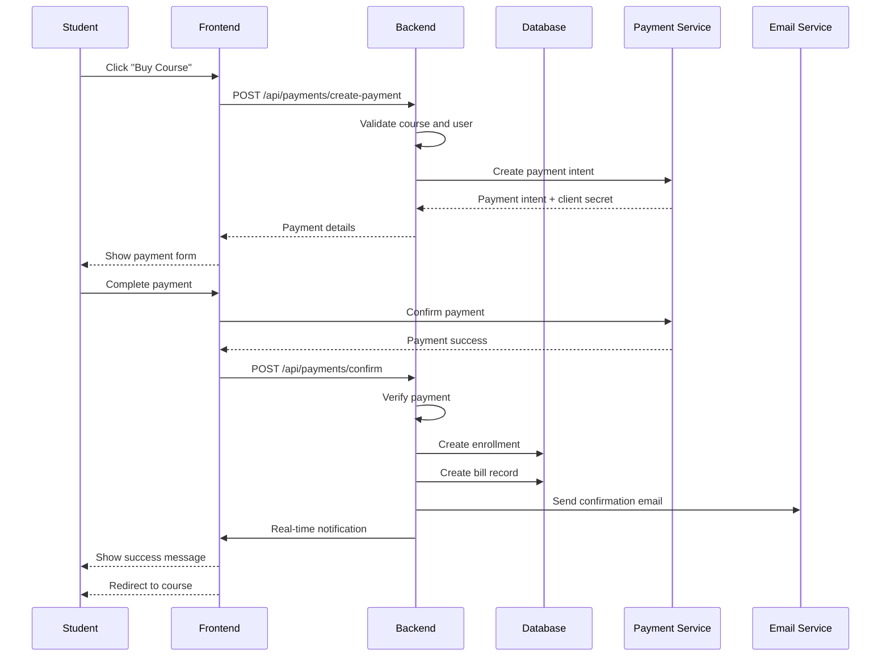
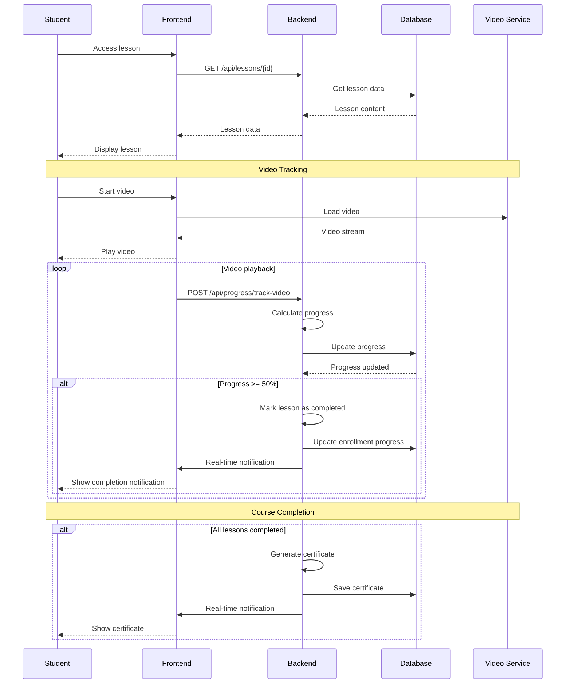
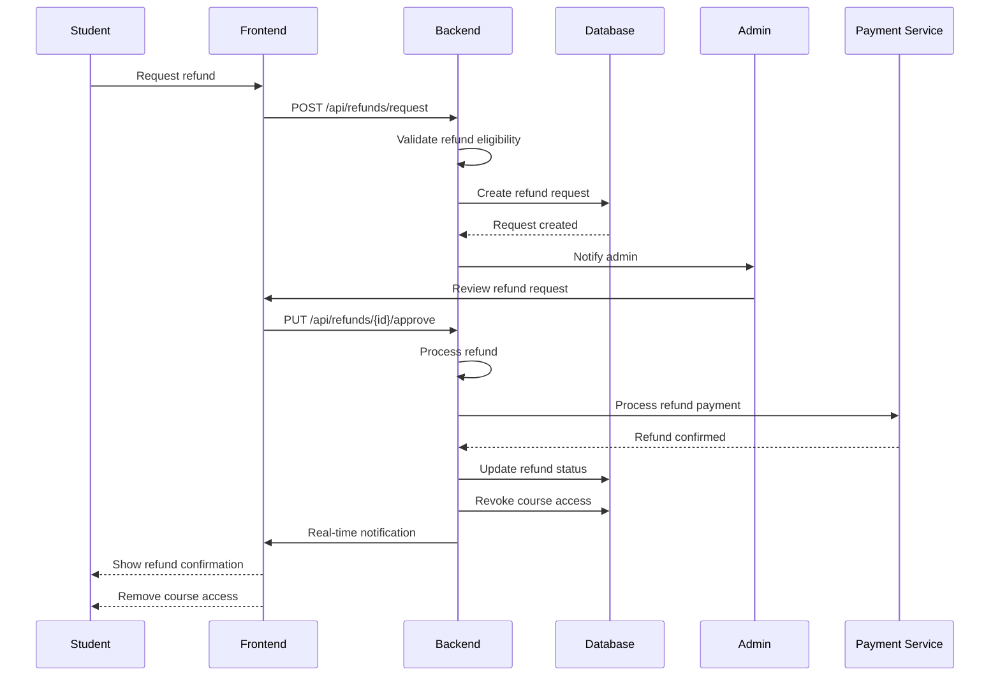

# THIẾT KẾ HỆ THỐNG LMS - LEARNING MANAGEMENT SYSTEM

## 📋 Tổng quan

**Dự án**: Hệ thống Quản lý Học tập (LMS)  
**Timeline**: 2-3 tháng  
**Team**: 1 người (Nguyễn Mạnh Hùng)  
**Budget**: 8M VND  

---

## 🏗️ 1. SƠ ĐỒ KIẾN TRÚC HỆ THỐNG

### 1.1 Kiến trúc tổng thể

```
┌─────────────────────────────────────────────────────────────────┐
│                        CLIENT LAYER                             │
├─────────────────────────────────────────────────────────────────┤
│  React App (Frontend)                                           │
│  ├── User Interface (Material-UI)                               │
│  ├── State Management (Redux Toolkit)                           │
│  ├── Real-time Communication (Socket.io Client)                 │
│  └── API Integration (Axios)                                    │
└─────────────────────────────────────────────────────────────────┘
                                │
                                │ HTTPS/WebSocket
                                ▼
┌─────────────────────────────────────────────────────────────────┐
│                    PRESENTATION LAYER                           │
├─────────────────────────────────────────────────────────────────┤
│  Express.js Server (Backend)                                    │
│  ├── API Routes (RESTful)                                       │
│  ├── Authentication (JWT)                                       │
│  ├── File Upload (Multer)                                       │
│  ├── Real-time Server (Socket.io)                               │
│  └── Middleware (CORS, Rate Limiting)                           │
└─────────────────────────────────────────────────────────────────┘
                                │
                                │ Internal Communication
                                ▼
┌─────────────────────────────────────────────────────────────────┐
│                     BUSINESS LOGIC LAYER                        │
├─────────────────────────────────────────────────────────────────┤
│  Services & Controllers                                         │
│  ├── User Service (Auth, Profile)                               │
│  ├── Course Service (CRUD, Management)                          │
│  ├── Payment Service (Stripe Integration)                       │
│  ├── AI Service (OpenAI Integration)                            │
│  ├── Notification Service (Email, Real-time)                    │
│  └── Analytics Service (Progress, Reports)                      │
└─────────────────────────────────────────────────────────────────┘
                                │
                                │ Database Operations
                                ▼
┌─────────────────────────────────────────────────────────────────┐
│                      DATA LAYER                                 │
├─────────────────────────────────────────────────────────────────┤
│  MongoDB Database                                               │
│  ├── Users Collection                                           │
│  ├── Courses Collection                                         │
│  ├── Sections Collection                                        │
│  ├── Lessons Collection                                         │
│  ├── Assignments Collection                                     │
│  ├── Submissions Collection                                     │
│  ├── Enrollments Collection                                     │
│  ├── Bills Collection                                           │
│  ├── RefundRequests Collection                                  │
│  └── CourseRatings Collection                                   │
└─────────────────────────────────────────────────────────────────┘
                                │
                                │ External APIs
                                ▼
┌─────────────────────────────────────────────────────────────────┐
│                   EXTERNAL SERVICES LAYER                       │
├─────────────────────────────────────────────────────────────────┤
│  ├── Cloudinary (Media Storage)                                 │
│  ├── Stripe (Payment Processing)                                │
│  ├── OpenAI API (AI Features)                                   │
│  ├── SendGrid (Email Service)                                   │
│  └── YouTube API (Video Embedding)                              │
└─────────────────────────────────────────────────────────────────┘
```

### 1.2 Kiến trúc chi tiết theo module

```
┌─────────────────────────────────────────────────────────────────┐
│                    FRONTEND ARCHITECTURE                        │
├─────────────────────────────────────────────────────────────────┤
│  src/                                                           │
│  ├── components/                                                │
│  │   ├── common/ (ProtectedRoute, Loading, Error)               │
│  │   ├── admin/ (Dashboard, UserManagement, CourseApproval)     │
│  │   ├── client/ (Home, Courses, Learning, Profile)             │
│  │   └── layout/ (Header, Footer, Sidebar)                      │
│  ├── pages/                                                     │
│  │   ├── admin/ (Admin Dashboard, Course Management)            │
│  │   └── client/ (Home, Course Detail, Learning Interface)      │
│  ├── services/ (API calls, Auth service)                        │
│  ├── store/ (Redux slices)                                      │
│  ├── types/ (TypeScript interfaces)                             │
│  └── utils/ (Helper functions)                                  │
└─────────────────────────────────────────────────────────────────┘

┌─────────────────────────────────────────────────────────────────┐
│                    BACKEND ARCHITECTURE                         │
├─────────────────────────────────────────────────────────────────┤
│  src/                                                           │
│  ├── routes/                                                    │
│  │   ├── auth.ts (Authentication routes)                        │
│  │   ├── courses.ts (Course management)                         │
│  │   ├── users.ts (User management)                             │
│  │   ├── payments.ts (Payment processing)                       │
│  │   └── admin.ts (Admin functions)                             │
│  ├── controllers/                                               │
│  │   ├── authController.ts                                      │
│  │   ├── courseController.ts                                    │
│  │   ├── userController.ts                                      │
│  │   └── paymentController.ts                                   │
│  ├── services/                                                  │
│  │   ├── authService.ts                                         │
│  │   ├── courseService.ts                                       │
│  │   ├── aiService.ts                                           │
│  │   └── notificationService.ts                                 │
│  ├── middleware/                                                │
│  │   ├── auth.ts (JWT verification)                             │
│  │   ├── upload.ts (File upload)                                │
│  │   └── validation.ts (Input validation)                       │
│  ├── models/ (MongoDB schemas)                                  │
│  └── utils/ (Helper functions)                                  │
└─────────────────────────────────────────────────────────────────┘
```

---

## 🛠️ 2. LỰA CHỌN CÔNG NGHỆ

### 2.1 Frontend Technology Stack

| **Công nghệ** | **Phiên bản** | **Lý do lựa chọn** | **Ưu điểm** | **Nhược điểm** |
|---------------|---------------|-------------------|-------------|----------------|
| **React** | 18.x | Framework phổ biến, cộng đồng lớn | - Virtual DOM hiệu quả<br>- Component-based<br>- Rich ecosystem | - Learning curve<br>- Boilerplate code |
| **TypeScript** | 5.x | Type safety, better IDE support | - Type checking<br>- Better refactoring<br>- Reduced bugs | - Additional complexity<br>- Build time overhead |
| **Material-UI** | 5.x | Design system hoàn chỉnh | - Ready-to-use components<br>- Consistent design<br>- Responsive | - Bundle size<br>- Customization limits |
| **Redux Toolkit** | 1.x | State management cho complex app | - Centralized state<br>- DevTools support<br>- Predictable updates | - Boilerplate<br>- Learning curve |
| **Socket.io Client** | 4.x | Real-time communication | - Real-time updates<br>- Easy integration<br>- Fallback support | - Additional complexity<br>- Connection management |

### 2.2 Backend Technology Stack

| **Công nghệ** | **Phiên bản** | **Lý do lựa chọn** | **Ưu điểm** | **Nhược điểm** |
|---------------|---------------|-------------------|-------------|----------------|
| **Node.js** | 18.x LTS | JavaScript runtime, fast development | - Fast development<br>- NPM ecosystem<br>- Non-blocking I/O | - Single-threaded<br>- Callback complexity |
| **Express.js** | 4.x | Lightweight, flexible framework | - Minimal overhead<br>- Middleware support<br>- Easy routing | - Less opinionated<br>- Security concerns |
| **TypeScript** | 5.x | Type safety cho backend | - Type checking<br>- Better refactoring<br>- API documentation | - Build complexity<br>- Runtime overhead |
| **MongoDB** | 6.x | NoSQL, flexible schema | - Flexible schema<br>- JSON-like documents<br>- Horizontal scaling | - No ACID transactions<br>- Memory usage |
| **Mongoose** | 7.x | ODM cho MongoDB | - Schema validation<br>- Middleware support<br>- TypeScript support | - Additional abstraction<br>- Performance overhead |

### 2.3 Third-party Services

| **Service** | **Lý do lựa chọn** | **Chi phí** | **Tính năng** |
|-------------|-------------------|-------------|---------------|
| **Cloudinary** | Media storage và optimization | Free tier + Pay-per-use | - Image/video upload<br>- Automatic optimization<br>- CDN delivery |
| **Stripe** | Payment processing | 2.9% + 30¢ per transaction | - Secure payments<br>- Multiple payment methods<br>- Webhook support |
| **OpenAI API** | AI features | Pay-per-token | - Text generation<br>- Image generation<br>- Content moderation |
| **SendGrid** | Email delivery | Free tier + Pay-per-email | - Reliable delivery<br>- Template support<br>- Analytics |
| **YouTube API** | Video embedding | Free tier | - Video metadata<br>- Embed support<br>- Analytics |

### 2.4 Development Tools

| **Tool** | **Mục đích** | **Lý do lựa chọn** |
|----------|-------------|-------------------|
| **Vite** | Build tool | Fast development, HMR |
| **ESLint** | Code linting | Code quality, consistency |
| **Prettier** | Code formatting | Consistent formatting |
| **Jest** | Unit testing | Testing framework |
| **Cypress** | E2E testing | UI testing |
| **Postman** | API testing | API development |
| **Docker** | Containerization | Consistent environment |

---

## 🔌 3. API SPECIFICATIONS (Swagger/OpenAPI)

### 3.1 Authentication APIs

#### **POST /api/auth/register** - Đăng ký tài khoản mới

**Mô tả**: Tạo tài khoản người dùng mới với email, password và thông tin cá nhân

**Request Body**:
```json
{
  "email": "user@example.com",
  "password": "password123",
  "name": "Nguyễn Văn A",
  "role": "student"
}
```

**Validation Rules**:
- `email`: Phải là email hợp lệ
- `password`: Tối thiểu 6 ký tự
- `name`: Không được để trống
- `role`: Chỉ nhận giá trị "student" hoặc "teacher"

**Response (201 - Success)**:
```json
{
  "success": true,
  "user": {
    "_id": "507f1f77bcf86cd799439011",
    "email": "user@example.com",
    "name": "Nguyễn Văn A",
    "roles": ["student"],
    "subscriptionPlan": "free",
    "isActive": true,
    "emailVerified": false,
    "createdAt": "2024-01-15T10:30:00Z"
  },
  "token": "eyJhbGciOiJIUzI1NiIsInR5cCI6IkpXVCJ9..."
}
```

**Response (400 - Error)**:
```json
{
  "success": false,
  "error": "Email already exists",
  "errorCode": 1001
}
```

---

#### **POST /api/auth/login** - Đăng nhập

**Mô tả**: Xác thực người dùng và trả về JWT token

**Request Body**:
```json
{
  "email": "user@example.com",
  "password": "password123"
}
```

**Response (200 - Success)**:
```json
{
  "success": true,
  "user": {
    "_id": "507f1f77bcf86cd799439011",
    "email": "user@example.com",
    "name": "Nguyễn Văn A",
    "roles": ["student", "teacher"],
    "subscriptionPlan": "pro",
    "avatar": "https://cloudinary.com/avatar.jpg"
  },
  "token": "eyJhbGciOiJIUzI1NiIsInR5cCI6IkpXVCJ9..."
}
```

**Response (401 - Invalid Credentials)**:
```json
{
  "success": false,
  "error": "Invalid email or password",
  "errorCode": 1201
}
```

---

#### **POST /api/auth/refresh** - Làm mới token

**Mô tả**: Tạo access token mới từ refresh token

**Headers**:
```
Authorization: Bearer <refresh_token>
```

**Response (200 - Success)**:
```json
{
  "token": "eyJhbGciOiJIUzI1NiIsInR5cCI6IkpXVCJ9..."
}
```

---

### 3.2 Course Management APIs

#### **GET /api/courses** - Lấy danh sách khóa học

**Mô tả**: Lấy danh sách khóa học với phân trang và lọc

**Query Parameters**:
| Parameter | Type | Default | Description |
|-----------|------|---------|-------------|
| `page` | integer | 1 | Trang hiện tại |
| `limit` | integer | 10 | Số khóa học mỗi trang |
| `domain` | string | - | Lọc theo lĩnh vực (IT, Economics, Law) |
| `level` | string | - | Lọc theo cấp độ (beginner, intermediate, advanced) |
| `search` | string | - | Tìm kiếm theo tên khóa học |

**Response (200 - Success)**:
```json
{
  "success": true,
  "courses": [
    {
      "_id": "507f1f77bcf86cd799439011",
      "title": "React Fundamentals",
      "description": "Học React từ cơ bản đến nâng cao",
      "thumbnail": "https://cloudinary.com/thumbnail.jpg",
      "domain": "IT",
      "level": "beginner",
      "instructorId": "507f1f77bcf86cd799439012",
      "price": 500000,
      "isPublished": true,
      "isApproved": true,
      "upvotes": 25,
      "reports": 0,
      "enrolledStudents": ["507f1f77bcf86cd799439013"],
      "createdAt": "2024-01-15T10:30:00Z"
    }
  ],
  "pagination": {
    "page": 1,
    "limit": 10,
    "total": 150,
    "totalPages": 15
  }
}
```

---

#### **POST /api/courses** - Tạo khóa học mới

**Mô tả**: Tạo khóa học mới (chỉ Teacher và Admin)

**Headers**:
```
Authorization: Bearer <access_token>
Content-Type: application/json
```

**Request Body**:
```json
{
  "title": "React Fundamentals",
  "description": "Học React từ cơ bản đến nâng cao",
  "domain": "IT",
  "level": "beginner",
  "price": 500000,
  "prerequisites": ["HTML", "CSS", "JavaScript"],
  "benefits": ["Hiểu React core concepts", "Build real projects", "Prepare for job"],
  "relatedLinks": ["https://github.com/example", "https://discord.gg/example"],
  "thumbnail": "https://cloudinary.com/thumbnail.jpg"
}
```

**Validation Rules**:
- `title`: 1-200 ký tự
- `description`: Tối thiểu 10 ký tự
- `domain`: Phải là một trong các giá trị hợp lệ
- `level`: beginner, intermediate, advanced
- `price`: Số dương

**Response (201 - Success)**:
```json
{
  "success": true,
  "course": {
    "_id": "507f1f77bcf86cd799439011",
    "title": "React Fundamentals",
    "description": "Học React từ cơ bản đến nâng cao",
    "domain": "IT",
    "level": "beginner",
    "price": 500000,
    "isPublished": false,
    "isApproved": false,
    "instructorId": "507f1f77bcf86cd799439012",
    "createdAt": "2024-01-15T10:30:00Z"
  }
}
```

**Response (400 - Validation Error)**:
```json
{
  "success": false,
  "error": "Title must be between 1 and 200 characters",
  "errorCode": 2001
}
```

---

#### **GET /api/courses/{id}** - Lấy chi tiết khóa học

**Mô tả**: Lấy thông tin chi tiết của một khóa học

**Path Parameters**:
| Parameter | Type | Required | Description |
|-----------|------|----------|-------------|
| `id` | string | Yes | ID của khóa học |

**Response (200 - Success)**:
```json
{
  "success": true,
  "course": {
    "_id": "507f1f77bcf86cd799439011",
    "title": "React Fundamentals",
    "description": "Học React từ cơ bản đến nâng cao",
    "thumbnail": "https://cloudinary.com/thumbnail.jpg",
    "domain": "IT",
    "level": "beginner",
    "prerequisites": ["HTML", "CSS", "JavaScript"],
    "benefits": ["Hiểu React core concepts", "Build real projects"],
    "relatedLinks": ["https://github.com/example"],
    "instructorId": "507f1f77bcf86cd799439012",
    "price": 500000,
    "isPublished": true,
    "isApproved": true,
    "upvotes": 25,
    "reports": 0,
    "enrolledStudents": ["507f1f77bcf86cd799439013"],
    "sections": [
      {
        "_id": "507f1f77bcf86cd799439014",
        "title": "Introduction to React",
        "lessons": [
          {
            "_id": "507f1f77bcf86cd799439015",
            "title": "What is React?",
            "type": "video",
            "videoUrl": "https://youtube.com/watch?v=example",
            "duration": 1200
          }
        ]
      }
    ],
    "createdAt": "2024-01-15T10:30:00Z"
  }
}
```

---

### 3.3 Payment APIs

#### **POST /api/payments/create-payment** - Tạo thanh toán

**Mô tả**: Tạo payment intent cho việc mua khóa học

**Headers**:
```
Authorization: Bearer <access_token>
Content-Type: application/json
```

**Request Body**:
```json
{
  "courseId": "507f1f77bcf86cd799439011",
  "amount": 500000,
  "currency": "VND"
}
```

**Response (200 - Success)**:
```json
{
  "success": true,
  "paymentIntent": {
    "id": "pi_3OqK8q2eZvKYlo2C1gQJ8X9Z",
    "amount": 500000,
    "currency": "vnd",
    "status": "requires_payment_method"
  },
  "clientSecret": "pi_3OqK8q2eZvKYlo2C1gQJ8X9Z_secret_..."
}
```

---

#### **POST /api/payments/confirm** - Xác nhận thanh toán

**Mô tả**: Xác nhận thanh toán và tạo enrollment

**Headers**:
```
Authorization: Bearer <access_token>
Content-Type: application/json
```

**Request Body**:
```json
{
  "paymentIntentId": "pi_3OqK8q2eZvKYlo2C1gQJ8X9Z",
  "courseId": "507f1f77bcf86cd799439011"
}
```

**Response (200 - Success)**:
```json
{
  "success": true,
  "enrollment": {
    "_id": "507f1f77bcf86cd799439016",
    "studentId": "507f1f77bcf86cd799439013",
    "courseId": "507f1f77bcf86cd799439011",
    "enrolledAt": "2024-01-15T10:30:00Z",
    "progress": 0,
    "completedLessons": []
  },
  "bill": {
    "_id": "507f1f77bcf86cd799439017",
    "amount": 500000,
    "currency": "VND",
    "status": "completed",
    "transactionId": "pi_3OqK8q2eZvKYlo2C1gQJ8X9Z"
  }
}
```

---

### 3.4 AI Integration APIs

#### **POST /api/ai/generate-avatar** - Tạo avatar bằng AI

**Mô tả**: Tạo avatar cho người dùng sử dụng OpenAI DALL-E

**Headers**:
```
Authorization: Bearer <access_token>
Content-Type: application/json
```

**Request Body**:
```json
{
  "name": "Nguyễn Văn A",
  "description": "Professional developer with glasses"
}
```

**Response (200 - Success)**:
```json
{
  "success": true,
  "avatarUrl": "https://cloudinary.com/ai-generated-avatar.jpg",
  "prompt": "Professional developer with glasses, digital art style"
}
```

**Response (402 - Subscription Required)**:
```json
{
  "success": false,
  "error": "AI features require Pro or Advanced subscription",
  "errorCode": 4001
}
```

---

#### **POST /api/ai/generate-thumbnail** - Tạo thumbnail khóa học

**Mô tả**: Tạo thumbnail cho khóa học sử dụng AI

**Headers**:
```
Authorization: Bearer <access_token>
Content-Type: application/json
```

**Request Body**:
```json
{
  "title": "React Fundamentals",
  "description": "Học React từ cơ bản đến nâng cao"
}
```

**Response (200 - Success)**:
```json
{
  "success": true,
  "thumbnailUrl": "https://cloudinary.com/ai-generated-thumbnail.jpg",
  "prompt": "Modern React course thumbnail with code elements"
}
```

---

#### **POST /api/ai/moderate-content** - Duyệt nội dung

**Mô tả**: Kiểm tra nội dung khóa học có phù hợp không

**Headers**:
```
Authorization: Bearer <access_token>
Content-Type: application/json
```

**Request Body**:
```json
{
  "content": "Học React từ cơ bản đến nâng cao",
  "contentType": "description"
}
```

**Response (200 - Success)**:
```json
{
  "success": true,
  "isAppropriate": true,
  "confidence": 0.95,
  "suggestions": [
    "Nội dung phù hợp cho mọi lứa tuổi",
    "Không chứa nội dung nhạy cảm"
  ],
  "moderationScore": 0.95
}
```

**Response (200 - Inappropriate Content)**:
```json
{
  "success": true,
  "isAppropriate": false,
  "confidence": 0.85,
  "suggestions": [
    "Nội dung có thể chứa từ ngữ không phù hợp",
    "Cần review lại trước khi publish"
  ],
  "moderationScore": 0.15
}
```

---

### 3.5 Data Models (Schemas)

#### **User Schema**
```typescript
interface User {
  _id: string;
  email: string;
  name: string;
  avatar?: string;
  roles: ('student' | 'teacher' | 'admin')[];
  subscriptionPlan: 'free' | 'pro' | 'advanced';
  subscriptionExpiresAt?: Date;
  isActive: boolean;
  emailVerified: boolean;
  createdAt: Date;
  updatedAt: Date;
}
```

#### **Course Schema**
```typescript
interface Course {
  _id: string;
  title: string;
  description: string;
  thumbnail?: string;
  domain: string;
  level: 'beginner' | 'intermediate' | 'advanced';
  prerequisites: string[];
  benefits: string[];
  relatedLinks: string[];
  instructorId: string;
  price: number;
  isPublished: boolean;
  isApproved: boolean;
  upvotes: number;
  reports: number;
  enrolledStudents: string[];
  createdAt: Date;
  updatedAt: Date;
}
```

#### **Enrollment Schema**
```typescript
interface Enrollment {
  _id: string;
  studentId: string;
  courseId: string;
  enrolledAt: Date;
  completedAt?: Date;
  progress: number; // 0-100
  completedLessons: string[];
  certificate?: string;
  createdAt: Date;
  updatedAt: Date;
}
```

#### **Bill Schema**
```typescript
interface Bill {
  _id: string;
  studentId: string;
  courseId: string;
  amount: number;
  currency: string;
  paymentMethod: string;
  status: 'pending' | 'completed' | 'failed' | 'refunded';
  transactionId: string;
  purpose: 'course_purchase' | 'subscription' | 'refund';
  paidAt?: Date;
  refundedAt?: Date;
  createdAt: Date;
  updatedAt: Date;
}
```

---

### 3.6 Error Codes

| **Error Code** | **Description** | **HTTP Status** |
|----------------|-----------------|-----------------|
| 1001 | Email already exists | 400 |
| 1002 | Invalid email format | 400 |
| 1003 | Password too short | 400 |
| 1201 | Invalid credentials | 401 |
| 1202 | Token expired | 401 |
| 1203 | Invalid token | 401 |
| 2001 | Course title validation failed | 400 |
| 2002 | Course not found | 404 |
| 2003 | Subscription limit exceeded | 402 |
| 3001 | Payment failed | 400 |
| 3002 | Insufficient funds | 400 |
| 4001 | AI feature requires subscription | 402 |
| 4002 | Content moderation failed | 400 |
| 5001 | File upload failed | 400 |
| 5002 | File too large | 400 |
| 9999 | Internal server error | 500 |

---

### 3.7 API Rate Limits

| **Endpoint** | **Rate Limit** | **Window** |
|--------------|----------------|------------|
| `/api/auth/*` | 5 requests | 1 minute |
| `/api/courses` | 100 requests | 1 minute |
| `/api/payments/*` | 10 requests | 1 minute |
| `/api/ai/*` | 20 requests | 1 minute |
| `/api/upload/*` | 10 requests | 1 minute |

---

### 3.8 Authentication Flow



---

## 🔄 4. THIẾT KẾ LUỒNG DỮ LIỆU

### 4.1 Luồng đăng ký và đăng nhập



### 4.2 Luồng tạo khóa học



### 4.3 Luồng mua khóa học



### 4.4 Luồng học tập và tracking



### 4.5 Luồng hoàn tiền



### 4.6 Data Flow Diagram (DFD)

```
┌─────────────────┐    ┌─────────────────┐    ┌─────────────────┐
│   User Input    │    │  Frontend App   │    │  Backend API    │
│                 │    │                 │    │                 │
│ - Registration  │───▶│ - Form handling │───▶│ - Validation    │
│ - Login         │    │ - State mgmt    │    │ - Authentication│
│ - Course data   │    │ - UI rendering  │    │ - Business logic│
│ - Payment info  │    │ - API calls     │    │ - File upload   │
└─────────────────┘    └─────────────────┘    └─────────────────┘
                                │                        │
                                │                        │
                                ▼                        ▼
┌─────────────────┐    ┌─────────────────┐    ┌─────────────────┐
│  Real-time      │    │   Database      │    │ External APIs   │
│  Communication  │    │   (MongoDB)     │    │                 │
│                 │    │                 │    │ - Cloudinary    │
│ - Notifications │◀───│ - Users         │◀───│ - Stripe        │
│ - Live updates  │    │ - Courses       │    │ - OpenAI        │
│ - Chat messages │    │ - Enrollments   │    │ - SendGrid      │
│                 │    │ - Payments      │    │ - YouTube       │
└─────────────────┘    └─────────────────┘    └─────────────────┘
```

---

## 🔒 5. BẢO MẬT VÀ HIỆU SUẤT

### 5.1 Security Measures

| **Layer** | **Security Measure** | **Implementation** |
|-----------|---------------------|-------------------|
| **Authentication** | JWT Tokens | - Access token (1 day)<br>- Refresh token (7 days)<br>- Secure cookie storage |
| **Authorization** | Role-based access | - User roles (student, teacher, admin)<br>- Route protection<br>- Resource-level permissions |
| **Data Protection** | Encryption | - Password hashing (bcrypt)<br>- HTTPS/TLS<br>- Database encryption |
| **Input Validation** | Sanitization | - Joi validation<br>- XSS protection<br>- SQL injection prevention |
| **Rate Limiting** | API protection | - Express-rate-limit<br>- IP-based limiting<br>- User-based limiting |
| **File Upload** | Security scanning | - File type validation<br>- Size limits<br>- Virus scanning |

### 5.2 Performance Optimization

| **Component** | **Optimization** | **Target** |
|---------------|------------------|------------|
| **Frontend** | Code splitting | - Lazy loading<br>- Bundle optimization<br>- Image compression |
| **Backend** | Caching | - Redis caching<br>- Database indexing<br>- Query optimization |
| **Database** | Indexing | - Compound indexes<br>- Text search indexes<br>- Geospatial indexes |
| **CDN** | Content delivery | - Static assets<br>- Media files<br>- Global distribution |
| **API** | Response time | - < 2s API response<br>- < 3s page load<br>- 99.9% uptime |

### 5.3 Scalability Considerations

| **Aspect** | **Current** | **Future** |
|------------|-------------|------------|
| **Database** | Single MongoDB instance | - Sharding<br>- Read replicas<br>- Connection pooling |
| **Application** | Single server | - Load balancing<br>- Auto-scaling<br>- Microservices |
| **Storage** | Cloudinary | - Multi-region CDN<br>- Backup strategy<br>- Disaster recovery |
| **Monitoring** | Basic logging | - APM tools<br>- Error tracking<br>- Performance monitoring |

---

## 📊 6. MONITORING VÀ LOGGING

### 6.1 Application Monitoring

```javascript
// Monitoring setup
const monitoring = {
  performance: {
    responseTime: '< 2s',
    throughput: '1000+ req/min',
    errorRate: '< 1%'
  },
  uptime: {
    target: '99.9%',
    monitoring: 'UptimeRobot',
    alerts: 'Email + Slack'
  },
  logging: {
    level: 'info',
    format: 'JSON',
    storage: 'CloudWatch'
  }
};
```

### 6.2 Error Tracking

```javascript
// Error handling middleware
app.use((error, req, res, next) => {
  logger.error({
    error: error.message,
    stack: error.stack,
    url: req.url,
    method: req.method,
    user: req.user?.id
  });
  
  res.status(500).json({
    success: false,
    message: 'Internal server error'
  });
});
```

---

## 🚀 7. DEPLOYMENT VÀ CI/CD

### 7.1 Deployment Strategy

| **Environment** | **Purpose** | **Deployment** |
|-----------------|-------------|----------------|
| **Development** | Local development | Docker Compose |
| **Staging** | Testing | Vercel + Railway |
| **Production** | Live application | Vercel + Railway |

### 7.2 CI/CD Pipeline

```yaml
# GitHub Actions workflow
name: Deploy LMS
on:
  push:
    branches: [main]

jobs:
  test:
    runs-on: ubuntu-latest
    steps:
      - uses: actions/checkout@v3
      - name: Install dependencies
        run: npm install
      - name: Run tests
        run: npm test
      - name: Build application
        run: npm run build

  deploy:
    needs: test
    runs-on: ubuntu-latest
    steps:
      - name: Deploy to Vercel
        uses: amondnet/vercel-action@v25
        with:
          vercel-token: ${{ secrets.VERCEL_TOKEN }}
          vercel-org-id: ${{ secrets.ORG_ID }}
          vercel-project-id: ${{ secrets.PROJECT_ID }}
```

---

## 📋 8. KẾT LUẬN

### 8.1 Tóm tắt thiết kế

✅ **Kiến trúc rõ ràng**: 4-layer architecture với separation of concerns  
✅ **Công nghệ hiện đại**: React + Node.js + MongoDB stack  
✅ **API documentation**: Swagger/OpenAPI specifications đầy đủ  
✅ **Luồng dữ liệu**: Mermaid diagrams cho tất cả use cases  
✅ **Bảo mật**: JWT, encryption, rate limiting  
✅ **Hiệu suất**: Caching, optimization, monitoring  
✅ **Scalability**: Microservices-ready architecture  

### 8.2 Next Steps

1. **Setup development environment** với Docker
2. **Implement core APIs** theo specifications
3. **Create frontend components** với Material-UI
4. **Setup CI/CD pipeline** với GitHub Actions
5. **Configure monitoring** và logging
6. **Deploy staging environment** để testing

### 8.3 Success Metrics

- **Performance**: < 2s API response, < 3s page load
- **Uptime**: 99.9% availability
- **Security**: Zero security incidents
- **User Experience**: > 90% user satisfaction
- **Development**: < 3 months to MVP

**Thiết kế hệ thống này đảm bảo tính khả thi, hiệu quả và khả năng mở rộng cho dự án LMS!** 🎯
